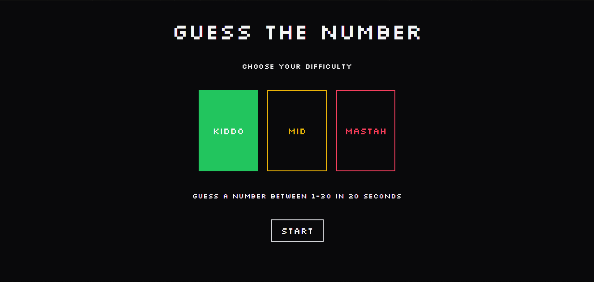

# GUESS IT

Guess It is a number guessing game built using React Vite, Tailwind, and Zustand. It is designed to be a fun and interactive game where players have to guess a number within a certain time limit.



## Installation

1. Make sure you have [Node.js](https://nodejs.org) installed.
2. Clone this repository or download the ZIP file and extract it.
3. Open a terminal and navigate to the project directory.
4. Run the following command to install the dependencies using yarn:

    ```shell
    yarn install
    ```

5. Start the development server using the following command:
    ```shell
    yarn dev
    ```
6. Open your web browser and visit http://localhost:3000

## How to Play

1. There are three levels: easy, medium, and hard.
    - Easy: Interval from 1 to 30.
    - Medium: Interval from 1 to 60.
    - Hard: Interval from 1 to 100.
2. Once you choose the level, the game will start, and you have 20 seconds to make your guess.
3. Type your guess in the input field and click the "Guess" button or press Enter.
4. You will receive feedback on whether your guess was too high or too low.
5. Keep guessing until you find the correct number or the time runs out.

## Contributing

Contributions are welcome! If you find any issues or have suggestions for improvements, please open an issue or submit a pull request.
